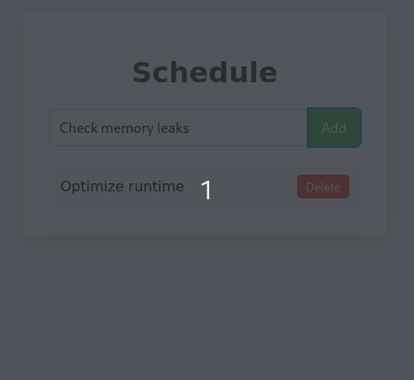

## 📋 Schedule Manager

A minimalist web app powered by Go + SQLite3 backend with a lightweight HTML/CSS frontend.


<p align="center">
  
</p>


## 🚀 Requirements

Go (version ≥ 1.18 recommended)
SQLite3

# Usage


## ⚙️Execution

### Dependencies
```bash
sudo apt update
sudo apt install -y docker.io docker-compose
sudo systemctl start docker
sudo systemctl enable docker
go get github.com/mattn/go-sqlite3
go get github.com/segmentio/kafka-go
```
### Backend setup.

Setup Docker for Kafka 
```bash
docker-compose up -d
```

Check docker
```bash
docker-compose ps
```
Initiate Go backend - Kafka Messages Appear in this terminal
```bash
cd backend
go run main.go
```


### Frontend setup.

Open index.html 

## To read database queries.
```bash
cd backend
sqlite3 tasks.db
```

Show all tables and schema of tasks table.
```bash
.tables
.schema tasks
```

See all tasks

```bash
 SELECT * FROM tasks;
```

Delete task 3 
```bash
DELETE FROM tasks WHERE id = 3;
```
Insert new task
```bash
INSERT INTO tasks(name) VALUES('Purge Cache');
```


